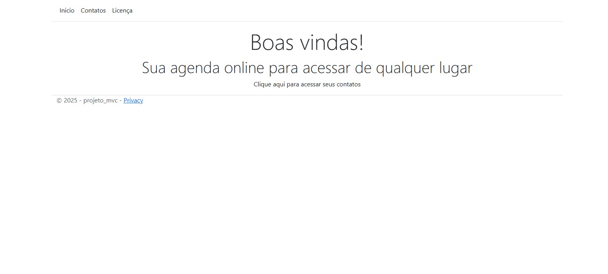

# 💻 Projeto MVC - Agenda de Contatos

Projeto foi desenvolvido no curso da Digital Innovation One: "Frontend com Asp.NET MVC". Ele contém uma aplicação ASP.NET Core MVC para gerenciamento de contatos. O projeto demonstra a implementação de um sistema CRUD usando Entity Framework Core e SQL Server.

## 🧭 Visão geral

- Aplicação ASP.NET Core MVC para gerenciamento de contatos
- Interface web intuitiva para criar, visualizar, atualizar e deletar contatos
- Persistência de dados usando Entity Framework Core e SQL Server
- Arquitetura MVC (Model-View-Controller) para separação de responsabilidades

## 🗂️ Estrutura do repositório

Raiz do repositório (resumo):

- `Context/` — configuração do Entity Framework e DbContext
- `Controllers/` — controladores MVC
- `Models/` — modelos de domínio
- `Views/` — views Razor
- `wwwroot/` — arquivos estáticos (CSS, JavaScript, etc.)
- `Program.cs` — configuração da aplicação
- `appsettings.json` — configurações do projeto

## ⚙️ Pré-requisitos

- .NET SDK 9.0
- Visual Studio 2022 ou VS Code
- SQL Server Express
- Entity Framework Core Tools: `dotnet tool install --global dotnet-ef`

## 🛠️ Configuração

As configurações principais estão em `appsettings.json` e `appsettings.Development.json`. Antes de executar:

1. Verifique a `ConnectionString` em `appsettings.Development.json`e  Ajuste a string de conexão conforme sua instalação do SQL Server.

```json
{
  "ConnectionStrings": {
    "DefaultConnection": "Server=localhost\\SQLEXPRESS;Database=AgendaMvc;Trusted_Connection=True;TrustServerCertificate=True;"
  }
}
```

## 🚀 Executando localmente

```powershell
# Clone o projeto e navegue até a raiz dentro do terminal
git clone https://github.com/erasmobezerra/dio-projeto-mvc.git
cd ./dio-projeto-mvc

# Restaurar pacotes e compilar o projeto
dotnet restore 
dotnet build

# Aplicar as migrations para criar o banco de dados
dotnet ef database update

# Executar a aplicação
dotnet watch run

# A aplicação abrirá automaticamente no seu navegador padrão.
```



## 🤝 Como contribuir

1. Crie uma branch com nome descritivo: `feature/minha-mudanca`.  
2. Faça commits pequenos e claros.  
3. Abra Pull Request descrevendo o que foi alterado e por quê.  

---

🙏 Agradeço profundamente à **Digital Innovation One** por proporcionar este aprendizado gratuito e de qualidade. Um reconhecimento especial ao professor **[Leonardo Buta](https://www.linkedin.com/in/leonardo-buta/)** pela excelente didática e orientação durante todo o processo.

<div align="center">
  <p>⭐ Se este projeto foi útil para você, considere dar uma estrela!</p>
</div>
